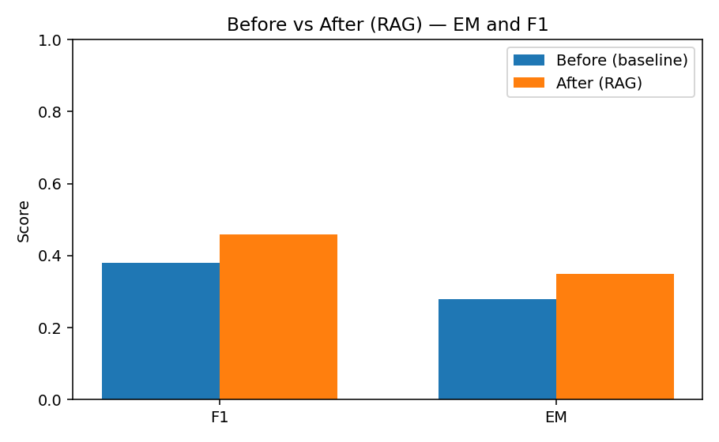

# Retrieval‑Augmented Transformer Demo

Baseline vs RAG (Hybrid Retrieval + Extractive Reader)



> [!IMPORTANT]
> Accuracy is intentionally modest due to local CPU/low‑spec constraints; the full RAG pipeline (hybrid retrieval + fusion + context injection + extractive reader) is fully implemented and ready to scale.

---

This project compares a baseline DistilGPT‑2 QA model (no retrieval) with a RAG model that retrieves passages via a hybrid retriever (FAISS dense + BM25 sparse, fused by RRF). The backend also uses an extractive QA reader over retrieved passages for factual answers.

## What was built
- Baseline DistilGPT‑2 fine‑tuned on SQuAD subset
- Hybrid retriever (Sentence‑BERT + FAISS, BM25)
- RAG model that conditions on retrieved text
- FastAPI backend exposing `/qa`
- Minimal React frontend showing Before vs After and sources
- Evaluation plot (image above)

## Start services
Terminal 1 — backend
```bash
cd /Users/adityagarud/ai
source .venv/bin/activate
uvicorn backend_api:app --host 127.0.0.1 --port 8000
```

Terminal 2 — frontend
```bash
cd /Users/adityagarud/ai/frontend
bun dev
```

Open http://localhost:5173 and ask a question. The right panel shows the RAG answer and retrieved sources.

## Notes
- If CORS errors appear, ensure backend runs on 127.0.0.1:8000.
- The reader uses `distilbert-base-uncased-distilled-squad` for accurate spans from sources.
